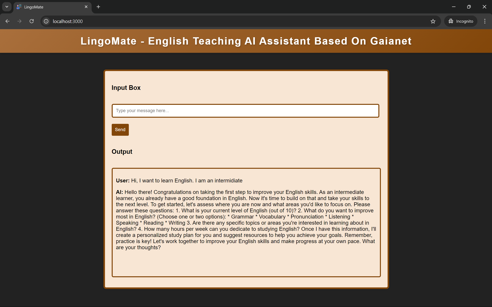

# LingoMate - English Teaching AI Assistant Based On Gaianet

LingoMate is an AI-powered English teaching assistant designed to help users improve their English skills. The chatbot provides interactive responses and guidance based on Gaianet Public Node, offering a seamless learning experience with the help of llama.



## Features

- **User-friendly Interface**: Simple and elegant interface for easy interaction.
- **AI-Powered Responses**: The assistant is powered by Gaianet AI to help with English teaching.
- **Real-time Feedback**: Immediate responses to user queries related to language learning.
- **Interactive Design**: Stylish layout with a modern design to enhance the user experience.

## Technologies Used

- HTML
- CSS
- JavaScript
- Node.js (for backend)
- Gaianet 

## Setup and Installation

1. Clone the repository:

   ```bash
   git clone https://github.com/username/lingomate.git

2. Navigate to the project directory:

    ```bash 
    cd lingomate

3. Install dependencies:

    ```bash 
    npm install

4. Start the development server:

    ```bash
    node index.js

5. Open your browser and visit:

    ```bash
    http://localhost:3000

## Thanks - Made with love 💕